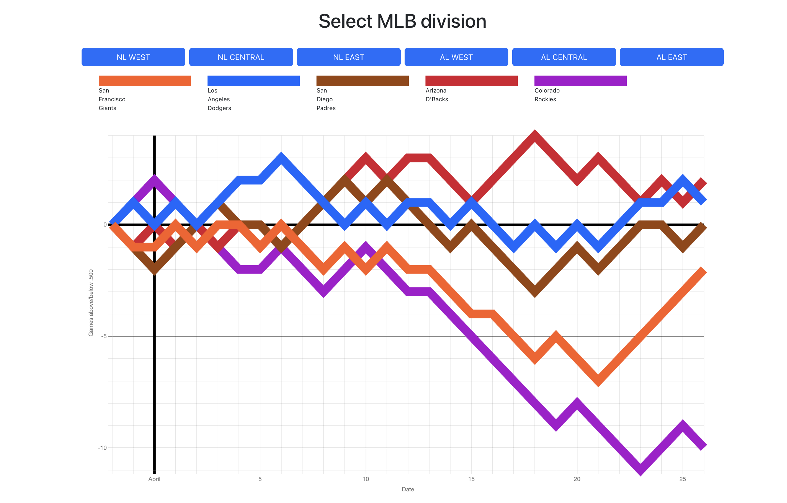

# Baseball Grapher

## Data visualization for the current MLB season
This app utilizes web-scraping with Cheerio to gather data pertaining to the current MLB season. It analyses wins, losses, off-days, and double-headers and graphs each division's standings over time.  The graph is made with Chart.js

[Come visit the Site!](https://baseball-grapher.herokuapp.com/)
## Overview of the application

  ## Table of Contents
  * [Technologies Used](#notable-technologies-used)
  * [Contact Me](#contact-me) 
​
  

​
  ## Notable Technologies Used
  ### Front end
  - React.js
  - JavaScript
  - CSS
  - Cheerio
  ### Back End
  - Node
  - NPM
  - Express
  - GraphQL
  - Apollo
  - MongoDB

    
    
  ## Contact Me
If you have any questions about this project, feel free to visit my github or reach out to me on linkedIn!
* Michael Seaman :
    * [Github](https://github.com/mseaman26)
    * [LinkedIn](https://www.linkedin.com/in/michael-seaman-120a59250/)

